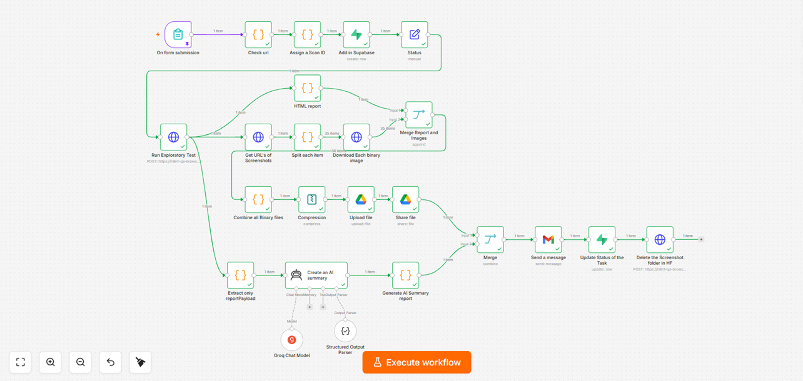

# 🌐 AI Website Quality Audit Platform

> A highly scalable, automated exploratory testing pipeline that recursively crawls websites, detects UI/UX anomalies, and generates interactive HTML reports alongside AI-driven risk assessments.

  <!-- PLACEHOLDER FOR WORKFLOW SCREENSHOT -->
  
   
  <i>n8n Architecture: Microservice Orchestration, Parallel Processing & State Management</i>

---

## 🚨 The Problem
Performing exploratory testing across an entire website involves manually checking every page for broken links, accessibility flaws, unoptimized load times, and broken forms. Scaling this process for large domains is practically impossible without a massive manual QA workforce.

## 💡 The Solution (System Architecture)
I engineered a hybrid solution combining **n8n orchestration** with a **custom Playwright + TypeScript microservice** hosted on Hugging Face Spaces. The system operates autonomously, manages its own state, and cleans up its resources after delivery.

### 🔄 End-to-End Workflow Execution
1. **Trigger & State Management:** 
   - User submits their Name, Email, and Target Website via an n8n Form.
   - A unique `Scan ID` is generated, and a record is created in a **Supabase PostgreSQL** database with an `In-Progress` status.
2. **Custom Playwright Crawler (Hugging Face Microservice):** 
   - The target URL is passed to a custom TS/Playwright script running on Hugging Face.
   - It recursively crawls *every* page of the domain, testing for: **Broken links, Accessibility issues, Empty form validations, Duplicate headers, Page load times, and Redirection loops.**
   - If an error is found on a page, it captures a screenshot, stores it in a temporary Hugging Face folder, and returns a detailed JSON report to n8n.
3. **Parallel Processing (Tri-Branch Architecture):**
   - **Branch 1 (HTML Generation):** A Code Node processes the JSON payload to dynamically render an interactive HTML report complete with pie charts and error details.
   - **Branch 2 (Asset Packaging):** Downloads all error screenshots (binary data) from Hugging Face. It then combines the HTML report and images into a `.zip` file, uploads it to **Google Drive**, and generates a shareable link with write access.
   - **Branch 3 (AI Risk Assessment):** The JSON data is fed into a **Groq AI Agent** utilizing a `Structured Output Parser`. The AI calculates a quantitative *Health Score* and generates a structured risk analysis summary.
4. **Delivery & Cleanup:**
   - Merges the ZIP file link and the AI risk summary, emailing them directly to the user.
   - Updates the Supabase record status to `Completed`.
   - Triggers an HTTP DELETE request to the Hugging Face API to wipe the temporary screenshot folder, ensuring zero storage bloat.

---

## ⚙️ Key Technical Implementations

| Technology / Logic | Purpose in System |
| :--- | :--- |
| **State Management (Supabase)** | Tracking the lifecycle of the audit (In-Progress vs. Completed) for database integrity. |
| **Microservice Integration** | Offloading heavy browser-crawling tasks to a custom Playwright script on Hugging Face instead of overloading n8n. |
| **Structured Output Parser** | Forcing the Groq LLM to strictly return a predefined JSON schema (Health Score, Risks) rather than raw text. |
| **Binary File Handling** | Managing raw image data, zipping files via n8n's Compression node, and handling Drive API permissions. |
| **Automated Resource Cleanup** | Implementing self-cleaning architecture to delete temporary assets post-execution. |

---

## 🛠️ How to Import and Use This Workflow

1. Download the `workflow.json` file from this repository folder.
2. Open your n8n instance -> **Workflows** -> **Add Workflow**.
3. Import the file.
4. **Prerequisites:** You will need your own Supabase instance, Google Workspace credentials, Groq API key, and the Hugging Face hosted Playwright microservice endpoint to run this end-to-end.
