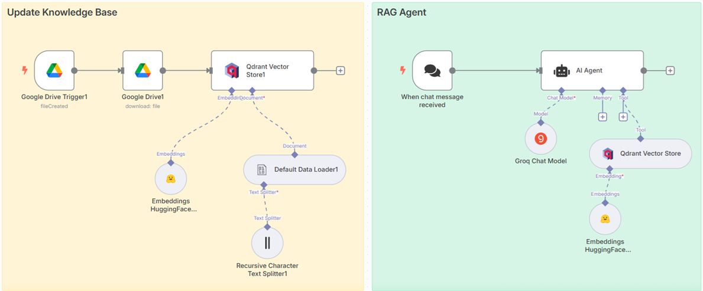

# 🧠 RAG Knowledge Assistant

> A dual-workflow Retrieval-Augmented Generation (RAG) system that autonomously ingests private documents into a Vector Database and serves an AI Chat Agent capable of answering context-aware queries.

  
   
  <i>Left: Automated Ingestion Pipeline | Right: AI Retrieval Agent</i>

---

## 🚨 The Problem
Standard LLMs hallucinate when asked about internal company data and lack access to private documents. Finding specific information across dozens of enterprise PDFs or documents is a manual, time-consuming bottleneck.

## 💡 The Solution (System Architecture)
I engineered a decoupled RAG architecture using **n8n**, splitting the system into two highly scalable pipelines: an event-driven **Ingestion Workflow** and an interactive **Retrieval Workflow**. 

### 🔄 Pipeline 1: Automated Knowledge Ingestion
Instead of manually uploading files to a vector store, this workflow automates the process:
1. **Event Trigger:** A Google Drive Trigger listens for any new document added to a specific knowledge-base folder.
2. **File Processing:** The workflow automatically downloads the binary file.
3. **Chunking & Splitting:** Passes the data through a `Default Data Loader` using a `Recursive Character Text Splitter` to break large documents into manageable, semantically meaningful chunks.
4. **Vector Indexing:** Generates embeddings using a **Hugging Face Embedding Model** and upserts the vectors directly into a **Qdrant Vector Store**.

### 🤖 Pipeline 2: AI Retrieval Agent
A conversational interface built to query the private data:
1. **Chat Trigger:** Initiates via n8n's native "When chat message received" trigger.
2. **AI Agent & LLM:** Powered by a **Groq Chat Model** for ultra-fast inference, configured with a strict system prompt tailored for RAG (preventing hallucinations).
3. **Tool Calling (Vector Search):** The AI Agent is equipped with a `Qdrant Vector Store` tool. When a user asks a question, the agent uses the same Hugging Face embedding model to perform a semantic search, retrieves the relevant document chunks, and synthesizes an accurate response.

---

## ⚙️ Key Technical Implementations

| Technology / Node | Purpose in System |
| :--- | :--- |
| **Decoupled Workflows** | Separating data ingestion from user querying ensures the system is scalable and easier to maintain. |
| **Qdrant Vector DB** | Used for high-performance similarity search and scalable vector storage. |
| **Hugging Face Embeddings** | Leveraged open-source embedding models for cost-effective and accurate vectorization of text. |
| **Recursive Text Splitter** | Ensures that text chunks retain context without cutting off sentences abruptly, improving retrieval accuracy. |

---

## 🛠️ How to Import and Use This Workflow

1. Download the `RAG_Knowledge_Assistant.json` file from this repository folder (contains both workflows).
2. Open your n8n instance -> **Workflows** -> **Add Workflow** -> **Import from File**.
3. **Prerequisites:**
   - A **Qdrant** cluster (Cloud or Local).
   - API keys for **Groq** and **Hugging Face**.
   - **Google Workspace** credentials to enable the Drive Trigger.
4. Set up a specific Google Drive folder for ingestion and map it in the trigger node.
