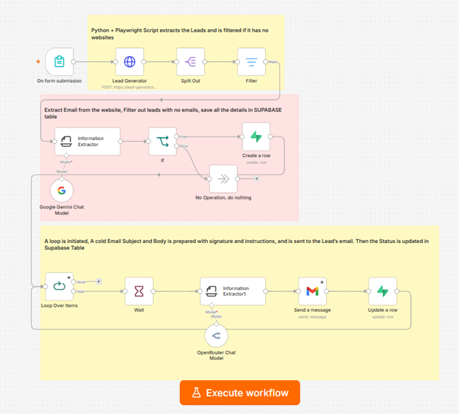

# 🎯 AI Lead Generation & Personalized Outreach Pipeline

> A zero-cost, highly scalable lead generation engine that replaces expensive commercial APIs. It uses a custom Python microservice to scrape public business data, enriches it via AI, and executes hyper-personalized cold email campaigns autonomously.

  
   
  <i>n8n Architecture: Custom Scraping, Double AI Pass Enrichment, and Automated Outreach</i>

---

## 🚨 The Problem
Traditional B2B lead generation relies on expensive SaaS tools (like Apollo or PhantomBuster). Furthermore, standard cold outreach is often generic, leading to low open rates and poor conversion. Manual scraping and personalization are not scalable.

## 💡 The Solution (System Architecture)
I engineered a custom, cost-effective alternative by pairing **n8n orchestration** with a **self-hosted Python + Playwright microservice**. This workflow autonomously discovers businesses, extracts contact details, filters unqualified leads, and uses advanced LLMs to write hyper-personalized emails.

### 🔄 End-to-End Workflow Execution
1. **Dynamic Intake:** The workflow triggers via an n8n form taking user inputs: `Niche`, `Location`, `Country`, and `Target Lead Count`.
2. **Custom Scraper Microservice (Cost Optimization):** 
   - Instead of paying for map APIs, an HTTP Request node sends the parameters to my custom Python script hosted on **Render**. 
   - The script performs stealthy scraping (incorporating dynamic waits to bypass bot detection) to extract Business Name, Category, Address, and Website.
3. **Data Filtration & First AI Pass (Enrichment):** 
   - Leads without websites are strictly filtered out.
   - For the remaining leads, an **Information Extractor Node (using Gemini Models)** scans the target websites to extract valid email addresses. 
   - Leads without emails are discarded, and the qualified data is pushed to a **Supabase** database.
4. **Second AI Pass (Hyper-Personalization):** 
   - A `Loop` node iterates through the qualified leads. 
   - An AI Agent (powered by **Gemini/OpenRouter**) is given deep context about the business to craft a highly relevant, personalized cold email subject and body, including dynamic signatures.
5. **Delivery & Database Sync:** 
   - The tailored email is dispatched via Gmail.
   - The Supabase record is updated to track the outreach status.

---

## ⚙️ Key Technical Implementations

| Technology / Node | Purpose in System |
| :--- | :--- |
| **Custom Python API** | Built and deployed a Playwright scraper on Render to completely eliminate third-party lead generation API costs. |
| **Double AI Pass Architecture** | Using AI first for *Data Enrichment* (Email extraction) and second for *Content Generation* (Personalized Copywriting). |
| **Data Quality Filtering** | Multi-stage IF/Filter nodes ensure only high-quality leads (with both website and email) reach the database, protecting sender reputation. |
| **Rate Limiting & Waits** | Implemented strategic wait nodes in n8n and Python scripts to prevent bot-detection and respect email sending limits. |

---

## 🛠️ How to Import and Use This Workflow

1. Download the `Lead Generation & AI Outreach Automation.json` file from this repository folder.
2. Open your n8n instance -> **Workflows** -> **Add Workflow** -> **Import from File**.
3. **Prerequisites:** 
   - You need a hosted instance of the Python scraper microservice for the HTTP node to target.
   - Add credentials for **Supabase**, **Google Workspace (Gmail)**, and your preferred **LLM API (Gemini/OpenRouter)**.
