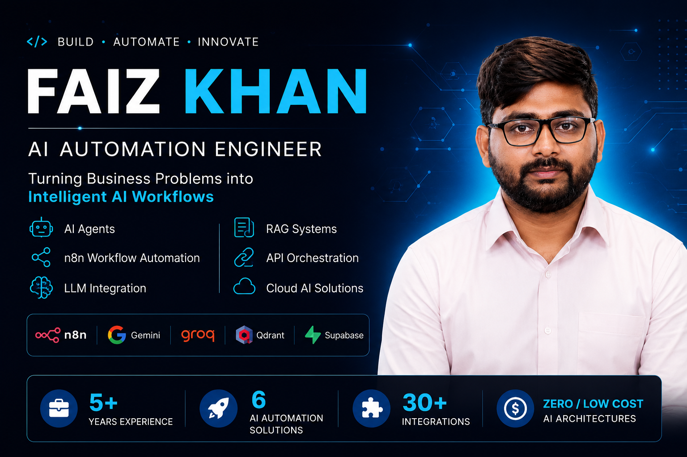
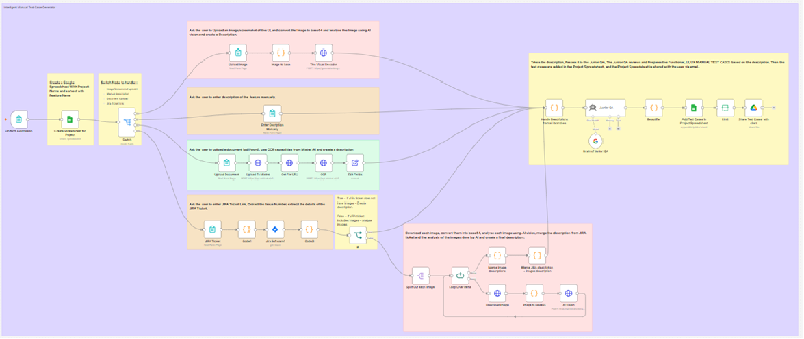
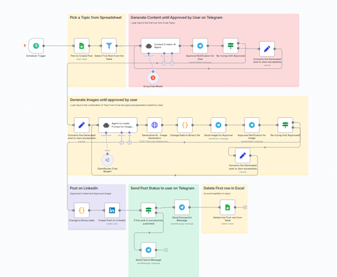
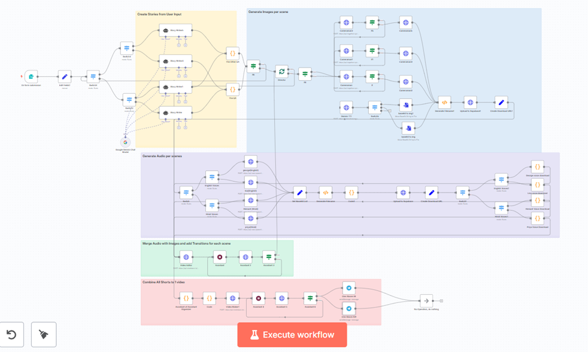

  <!-- MASTER PORTFOLIO BANNER -->
  
  
    
  
  <!-- DOWNLOAD RESUME BUTTON -->
  

---

## 🛠️ Core Technical Arsenal

* **Workflow Orchestration:** n8n (Advanced Loops, Switch Routing, Sub-workflows, Webhooks, Error Handling)
* **AI & LLM Integration:** Google Gemini (Vision/Flash/TTS), Groq, OpenRouter, Together AI (Flux)
* **Languages & Automation Frameworks:** Python, TypeScript, JavaScript, Playwright (Exploratory Testing/Scraping)
* **Data & Vector Infrastructure:** Supabase (PostgreSQL & Storage Buckets), Qdrant Vector DB, JSON/Base64 Parsing
* **Integrations & Delivery:** Jira REST API, Telegram Bots (HITL), Mistral OCR, Google Workspace, LinkedIn API
* **Hosting & Cloud Ecosystem:** Render, Hugging Face Spaces, GitHub Pages

---

## 💻 Featured Autonomous Solutions

<table border="0">
  <tr>
    <td width="50%" valign="top" style="border: 1px solid #30363d; border-radius: 10px; padding: 15px;">
      
      <h3><a href="./01.%20Intelligent%20Manual%20Test%20Case%20Generator/">🧪 01. Intelligent Manual Test Case Generator</a></h3>
      
Autonomously extracts functional QA context from Jira tickets, text, or UI mockups via Gemini Vision to auto-write Positive, Negative, and Edge test cases into dynamic Google Sheets.

      

        
        
        
      

    </td>
    <td width="50%" valign="top" style="border: 1px solid #30363d; border-radius: 10px; padding: 15px;">
      
      <h3><a href="./02.%20AI%20Website%20Quality%20Audit%20Platform/">🌐 02. AI Website Quality Audit Platform</a></h3>
      
An automated exploratory testing system utilizing a custom Playwright + TS microservice to spot domain-wide UI/UX anomalies, managing live states in Supabase with interactive HTML reports.

      

        
        
        
      

    </td>
  </tr>
  <tr>
    <td width="50%" valign="top" style="border: 1px solid #30363d; border-radius: 10px; padding: 15px;">
      
      <h3><a href="./03.%20RAG%20Knowledge%20Assistant/">🧠 03. RAG Knowledge Assistant</a></h3>
      
A decoupled architecture splitting event-driven real-time document ingestion (Google Drive) from a high-performance conversational AI agent using vector similarity search.

      

        
        
        
      

    </td>
    <td width="50%" valign="top" style="border: 1px solid #30363d; border-radius: 10px; padding: 15px;">
      
      <h3><a href="./04.%20Lead%20Generation%20%26%20AI%20Outreach%20Automation/">🎯 04. Lead Gen & AI Outreach Automation</a></h3>
      
A zero-cost enterprise engine replacing paid APIs. Uses a custom self-hosted scraper to harvest targets, verifies emails with AI, and executes hyper-personalized cold outreach loops.

      

        
        
        
      

    </td>
  </tr>
  <tr>
    <td width="50%" valign="top" style="border: 1px solid #30363d; border-radius: 10px; padding: 15px;">
      
      <h3><a href="./05.%20LinkedIn%20Content%20Automation%20Platform/">📱 05. LinkedIn Content Automation Platform</a></h3>
      
A schedule-driven content engine integrating a dual Human-in-the-Loop (HITL) approval system via Telegram. Autonomously generates contextual text and Flux images before publishing.

      

        
        
        
      

    </td>
    <td width="50%" valign="top" style="border: 1px solid #30363d; border-radius: 10px; padding: 15px;">
      
      <h3><a href="./06.%20AI%20Shorts%20Video%20Generation%20Pipeline/">🎬 06. AI Shorts Video Generation Pipeline</a></h3>
      
A 100% free, programmatic video creation engine. Destructures an AI script into 10 multi-lingual audio/visual scenes, calculating precise timing and rendering via Shotstack API.

      

        
        
        
      

    </td>
  </tr>
</table>

---

## 📈 Core Engineering Principles

1. **Cost Optimization & Native Code:** Whenever third-party SaaS tools introduce hefty overheads, I build customized microservices (Python/TypeScript) to replicate identical results at zero cost.
2. **Human-in-the-Loop (HITL) Safety:** Pure automation is powerful, but enterprise safety requires dynamic checkpoints. I build structured pause-and-resume webhooks using accessible chat interfaces like Telegram.
3. **Decoupled System Design:** Heavy computing processes (like recursive web crawling or browser automation) are isolated to containerized workers to avoid bottlenecking primary orchestration pipelines.

---

## 🤝 Let's Connect & Scale Your Workflows!

I am actively looking for opportunities in **AI Workflow Automation, QA Architecture, and Intelligent Agent Development**.

* **LinkedIn:** https://www.linkedin.com/in/faiz-khan-8a2b36228/
* **Email:** mailto:1990.faizkhan@gmail.com
* **Portfolio Website:** [FaizKhandev2119.github.io](https://FaizKhandev2119.github.io)

---

<i>Engineered with ⚡ using advanced n8n frameworks and Multimodal LLMs.</i>

